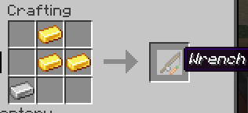

# Vanilla-Wrenchable
Minecraft Fabric wrench mod using [Zundrel's Wrenchable API](https://github.com/Zundrel/Wrenchable) but modified to work server-side (Works on singleplayer too!). Use the wrench to easily rotate blocks like pistons, stairs, glazed terracotta, etc.

## Crafting

## How to use:
* Right click to rotate
* Sneak and right click for wrench modifier (i.e. rotate pistons vertically)

## Requirements
* nbt-crafting - https://www.curseforge.com/minecraft/mc-mods/nbt-crafting

## Future Plans
* Config file to change crafting recipe
* Right now, any carrot on a stick named "Wrench" will work. That is MEGA cringe. We only want the wrench that gets crafted to work.